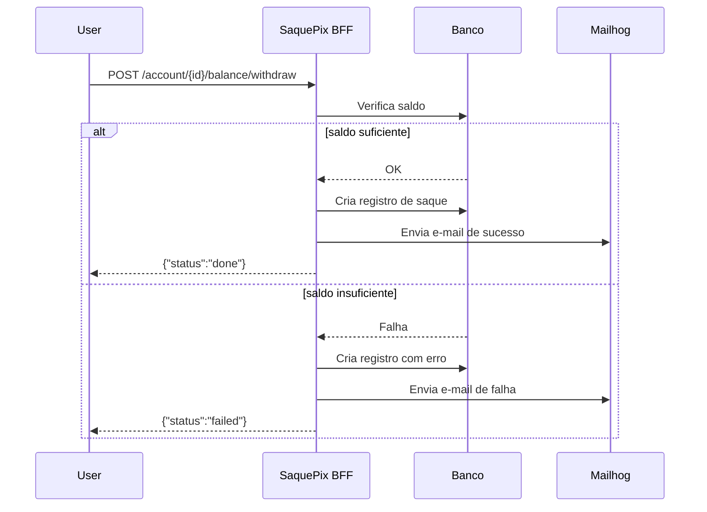

# 💸 Saque Pix BFF — Hyperf 3.x

API Backend construída em **PHP 8.2 + Hyperf 3.x**, projetada para orquestrar **saques via PIX**, simulando o fluxo de débito de conta, registro de saque, notificações por e-mail e autenticação JWT.

---

## 🧭 Prefácio

### 🧰 Tecnologias Utilizadas

| Componente | Descrição |
|-------------|------------|
| **[Hyperf 3.x](https://hyperf.wiki/)** | Framework PHP de alta performance baseado em Swoole. |
| **Swoole** | Extensão C para PHP que oferece IO assíncrono e servidor HTTP embutido. |
| **Redis** | Cache e fila assíncrona para processamento de eventos (ex: e-mails). |
| **Mailhog** | SMTP fake para visualização de e-mails locais. |
| **Docker + Docker Compose** | Padroniza ambiente e facilita setup local. |
| **Firebase JWT (php-jwt)** | Biblioteca oficial e segura para autenticação via tokens JWT. |

### 🎯 Motivações Técnicas

- **Performance:** Hyperf utiliza corrotinas, garantindo throughput muito maior que FPM.
- **Arquitetura limpa:** separação em camadas (Domain / Application / Infrastructure / Interface).
- **Segurança:** middleware JWT protege rotas sensíveis.
- **Observabilidade:** endpoint `/metrics` preparado para Prometheus.
- **DX:** ambiente pronto com Docker + Mailhog.

---

## 🐳 Execução via Docker

```bash
git clone git@github.com:josefcts/saque-pix-bff.git
cd saque-pix-bff
cp .env.example .env
docker compose up -d --build
```

### Serviços

| Serviço | Porta | Descrição |
|----------|--------|------------|
| **App (Hyperf)** | `9501` | API principal |
| **Mailhog** | `8025` | UI dos e-mails |
| **Redis** | `6379` | Cache e fila assíncrona |

Logs:
```bash
docker compose logs -f app
```

---

## ⚙️ `.env` Exemplo

```ini
APP_ENV=local
APP_DEBUG=true
SERVER_HOST=0.0.0.0
SERVER_PORT=9501

REDIS_HOST=redis
REDIS_PORT=6379

MAIL_MAILER=smtp
MAIL_HOST=mailhog
MAIL_PORT=1025
MAIL_FROM_ADDRESS="no-reply@local.test"
MAIL_FROM_NAME="Saque Pix"

JWT_SECRET=super_secret_key_123
JWT_ALGO=HS256
JWT_TTL=3600
JWT_NO_EXPIRY=true
```

---

## 🔑 Autenticação JWT

### Gerar token infinito

```bash
curl -X POST http://localhost:9501/auth/token
```

**Resposta:**
```json
{"token":"eyJ0eXAiOiJKV1QiLCJhbGciOiJIUzI1NiJ9..."}
```

### Testar rota protegida

```bash
TOKEN="<cole_o_token_aqui>"
curl -H "Authorization: Bearer $TOKEN" http://localhost:9501/metrics
```

---

## 💰 Cenários de Saques (com exemplos cURL)

### 🔹 1️⃣ Saque Imediato — Saldo suficiente

```bash
TOKEN="<token>"
curl -X POST http://localhost:9501/account/123/balance/withdraw   -H "Authorization: Bearer $TOKEN"   -H "Content-Type: application/json"   -d '{
    "accountId": "123",
    "amount": 150.00,
    "method": "pix",
    "pix": {
      "key": "user@example.com",
      "type": "email"
    }
  }'
```

**Resposta esperada:**
```json
{
  "withdraw_id": "uuid-abc123",
  "status": "done"
}
```
📬 Um e-mail de sucesso é enviado ao destinatário via Mailhog ([http://localhost:8025](http://localhost:8025)).

---

### 🔹 2️⃣ Saque Imediato — Saldo insuficiente

```bash
TOKEN="<token>"
curl -X POST http://localhost:9501/account/999/balance/withdraw   -H "Authorization: Bearer $TOKEN"   -H "Content-Type: application/json"   -d '{
    "accountId": "999",
    "amount": 999999.99,
    "method": "pix",
    "pix": {
      "key": "user@example.com",
      "type": "email"
    }
  }'
```

**Resposta esperada:**
```json
{
  "withdraw_id": "uuid-xyz789",
  "status": "failed",
  "error": "INSUFFICIENT_FUNDS"
}
```
📬 Um e-mail de falha é enviado via Mailhog.

---

### 🔹 3️⃣ Saque Agendado — Execução futura

```bash
TOKEN="<token>"
curl -X POST http://localhost:9501/account/123/balance/withdraw   -H "Authorization: Bearer $TOKEN"   -H "Content-Type: application/json"   -d '{
    "accountId": "123",
    "amount": 300.00,
    "method": "pix",
    "schedule": "2025-10-10T09:00:00Z",
    "pix": {
      "key": "user@example.com",
      "type": "email"
    }
  }'
```

**Resposta esperada:**
```json
{
  "withdraw_id": "uuid-123456",
  "status": "scheduled"
}
```

---

### 🔹 4️⃣ Healthcheck

```bash
curl http://localhost:9501/healthz
```
```json
{"status":"ok","time":"2025-10-06T23:00:00Z"}
```

---

## 🧩 Fluxo (Mermaid)



---

## 📬 E-mails

Acesse Mailhog para visualizar os e-mails enviados:
🔗 [http://localhost:8025](http://localhost:8025)

---

👨‍💻 Autor: **José Francisco Chacon Torres**
