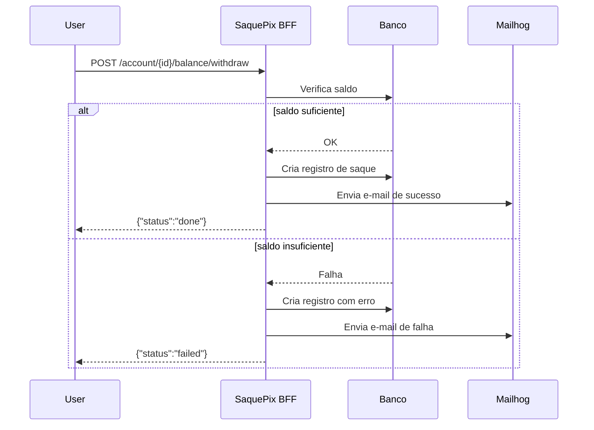

# 💸 Saque Pix BFF — Hyperf 3.x (com cenários de falha + migrações/seed + métricas)

Este README contém instruções completas para rodar o projeto via Docker, configurar o `.env`, obter um JWT token, executar **migrações e seeds**, cenários de movimentações (sucesso e falhas) com exemplos em `curl`, e como **expor/consumir métricas**. Também inclui um diagrama Mermaid do fluxo.

---

## 🧭 Prefácio (resumo)

O projeto é um BFF para orquestrar saques via PIX, escrito em **PHP 8+ com Hyperf**, usando **Swoole**, **Redis**, **Mailhog** para testes de e-mail e **firebase/php-jwt** para tokens JWT. A escolha foca em performance, arquitetura limpa e facilidade de teste local com Docker.

---

## 🐳 Execução via Docker

```bash
git clone git@github.com:josefcts/saque-pix-bff.git
cd saque-pix-bff
cp .env.example .env
docker compose up -d --build
```

Ver logs do app:
```bash
docker compose logs -f app
```

Mailhog UI: http://localhost:8025  
API: http://localhost:9501

---

## ⚙️ `.env` Exemplo

```ini
APP_ENV=local
APP_DEBUG=true
SERVER_HOST=0.0.0.0
SERVER_PORT=9501

# Banco (se usar MySQL/Postgres, ajuste conforme seu docker-compose)
DB_DRIVER=mysql
DB_HOST=db
DB_PORT=3306
DB_DATABASE=saquepix
DB_USERNAME=root
DB_PASSWORD=root

REDIS_HOST=redis
REDIS_PORT=6379

MAIL_MAILER=smtp
MAIL_HOST=mailhog
MAIL_PORT=1025
MAIL_FROM_ADDRESS="no-reply@local.test"
MAIL_FROM_NAME="Saque Pix"

JWT_SECRET=super_secret_key_123
JWT_ALGO=HS256
JWT_TTL=3600
JWT_NO_EXPIRY=true
```

> ⚠️ Se você não usa DB, remova/ignore as variáveis `DB_*`. Se usa, confirme que o container `db` existe no `docker-compose.yml`.

---

## 🗃️ Migrações e Seeds

### Executar migrações
Dentro do container `app`:
```bash
docker compose exec app php bin/hyperf.php migrate
```
ou, caso use o pacote de migrações do Hyperf (hyperf/database):
```bash
docker compose exec app php bin/hyperf.php migrate --force
```

### Reverter a última migração
```bash
docker compose exec app php bin/hyperf.php migrate:rollback
```

### Rodar seeds (popular dados iniciais)
```bash
docker compose exec app php bin/hyperf.php db:seed
```
Se houver seeder específico:
```bash
docker compose exec app php bin/hyperf.php db:seed --class=Database\Seeders\AccountSeeder
```
> Ajuste o namespace/classe conforme sua estrutura (ex.: `App\Infrastructure\Database\Seeders\...`).

### Dicas
- Se o comando não existir, confirme a instalação de `hyperf/database` e o provider de migrações/seed no projeto.
- Garanta que `DB_*` do `.env` apontem para o host/porta corretos do container de banco.

---

## 🔑 Autenticação JWT

### Gerar token (rota pública de teste)
```bash
curl -X POST http://localhost:9501/auth/token
```

**Resposta exemplo:**
```json
{"token":"eyJ0eXAiOiJKV1QiLCJhbGciOiJIUzI1NiJ9..."}
```

Use o token em rotas protegidas:
```bash
TOKEN="<token>"
curl -H "Authorization: Bearer $TOKEN" http://localhost:9501/metrics
```

---

## 📈 Métricas

### Endpoint
- **Rota:** `GET /metrics` (protegida por JWT, se você adicionou o middleware ao grupo de rotas)
- **Formato:** texto/Prometheus exposition format (ou JSON, conforme seu `MetricsController`)

### cURL (com JWT)
```bash
TOKEN="<token>"
curl -H "Authorization: Bearer $TOKEN" http://localhost:9501/metrics
```

### Exemplo de scrape no Prometheus
No `prometheus.yml`:
```yaml
scrape_configs:
  - job_name: 'saque-pix-bff'
    metrics_path: /metrics
    static_configs:
      - targets: ['app:9501']
    bearer_token: "<token_jwt_sem_expiracao>"
```
> Alternativas: liberar `/metrics` publicamente em dev ou injetar o token via relabel/config. Em produção, prefira autenticação (JWT, mTLS, sidecar).

---

## 💰 Cenários de Saque (com exemplos cURL)

### 1) Saque Imediato — Saldo suficiente (sucesso)
```bash
TOKEN="<token>"
curl -s -X POST http://localhost:9501/account/123/balance/withdraw   -H "Authorization: Bearer $TOKEN"   -H "Content-Type: application/json"   -d '{
    "accountId": "123",
    "amount": 150.00,
    "method": "pix",
    "pix": {"key": "user@example.com", "type": "email"}
  }'
```
**Resposta esperada:**
```json
{"withdraw_id":"uuid-abc123","status":"done"}
```
E-mail de sucesso visível em Mailhog (http://localhost:8025).

---

### 2) Saque Imediato — Saldo insuficiente (falha tratada)
```bash
TOKEN="<token>"
curl -s -X POST http://localhost:9501/account/999/balance/withdraw   -H "Authorization: Bearer $TOKEN"   -H "Content-Type: application/json"   -d '{
    "accountId": "999",
    "amount": 999999.99,
    "method": "pix",
    "pix": {"key": "user@example.com", "type": "email"}
  }'
```
**Resposta esperada:**
```json
{"withdraw_id":"uuid-xyz789","status":"failed","error":"INSUFFICIENT_FUNDS"}
```
E-mail de notificação de falha enviado ao PIX email.

---

### 3) Saque Agendado — Execução futura
```bash
TOKEN="<token>"
curl -s -X POST http://localhost:9501/account/123/balance/withdraw   -H "Authorization: Bearer $TOKEN"   -H "Content-Type: application/json"   -d '{
    "accountId": "123",
    "amount": 300.00,
    "method": "pix",
    "schedule": "2025-10-10T09:00:00Z",
    "pix": {"key": "user@example.com", "type": "email"}
  }'
```
**Resposta esperada:**
```json
{"withdraw_id":"uuid-123456","status":"scheduled"}
```

---

## ⚠️ Cenários de Falha (com exemplos e como diagnosticar)

### Falha A — Token ausente ou inválido (401)
```bash
curl -s -X POST http://localhost:9501/account/123/balance/withdraw   -H "Content-Type: application/json"   -d '{"accountId":"123","amount":10,"method":"pix"}'
```
**Resposta:**
```json
{"error":"unauthorized","message":"Missing Bearer token"}
```

### Falha B — Token expirado / inválido (401)
```bash
TOKEN="token_invalido"
curl -s -H "Authorization: Bearer $TOKEN" http://localhost:9501/metrics
```
**Resposta:**
```json
{"error":"unauthorized","message":"Invalid or expired token"}
```

### Falha C — Mail (SMTP connect failed)
- Pare o Mailhog: `docker compose stop mailhog`
- Realize um saque que enviaria e-mail
- Verifique logs do app: `docker compose logs app`  
Solução: `docker compose up -d mailhog` e confira `MAIL_*` no `.env`.

### Falha D — Banco de dados indisponível (500)
- Pare o DB: `docker compose stop db`
- Faça uma requisição que toca no DB  
Resposta típica: erro 500/SQLSTATE nos logs.  
Solução: `docker compose up -d db` e rode migrações novamente se necessário.

### Falha E — Chave PIX inválida (não-email)
```bash
TOKEN="<token>"
curl -s -X POST http://localhost:9501/account/123/balance/withdraw   -H "Authorization: Bearer $TOKEN"   -H "Content-Type: application/json"   -d '{"accountId":"123","amount":10,"method":"pix","pix":{"key":"5591999999999","type":"phone"}}'
```
Comportamento: saque pode ser `done`/`failed`, mas **não há e-mail** (a lógica só envia quando `pix.key` é e-mail).

---

## 🧩 Fluxo (Mermaid)



---

## 📬 Visualizar e-mails

Mailhog UI: http://localhost:8025

---

## 🧪 Dicas rápidas de debugging

- JWT: conferir `JWT_SECRET` e claims; para token infinito, não use `exp` (ou `JWT_NO_EXPIRY=true`).
- SMTP: teste conectividade com `telnet mailhog 1025`; veja logs em `docker compose logs mailhog`.
- DB: confirme env `DB_*`; use `docker compose exec db ...` para acessar.
- App: `docker compose logs -f app` para stacktraces e mensagens.

---

👨‍💻 **Autor:** José Francisco Chacon
